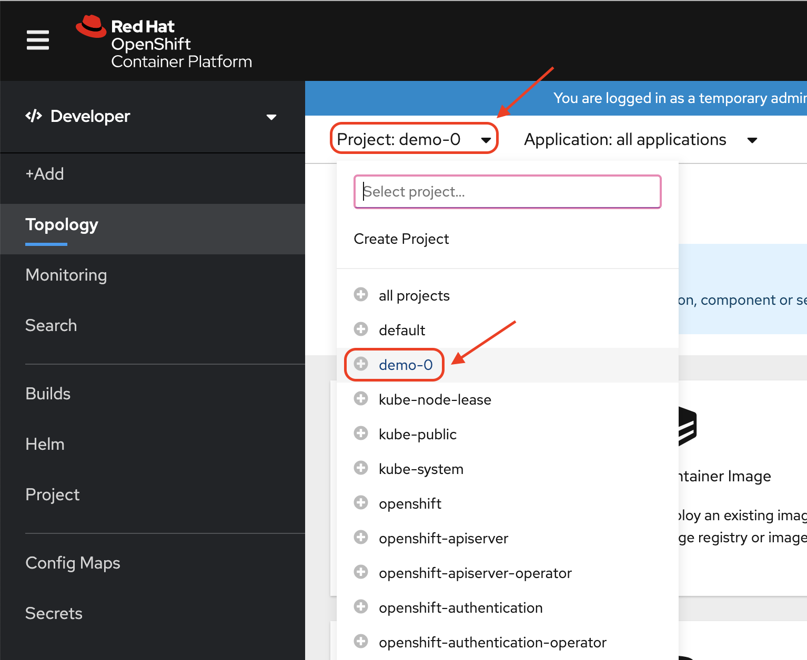
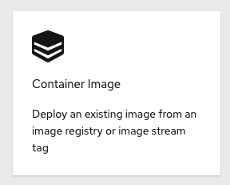
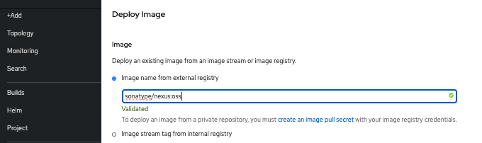

## Web Console Steps (Optional)

## Let's point OpenShift to an existing built container image

1. Switch to "Developer" mode, by clicking on the menu, in the top left corner, where it says "Administrator", and pick "Developer"

    
1. Switch to "Project: demo-0", by clicking on the menu, in the top left, where it says "Project" and pick "demo-0"

    
1. Click "+Add"

    
1. Click "Container Image", to add an existing image from the container registry

    
1. Select the option for "Image name from external registry" and enter "sonatype/nexus:oss", then ensure that the image is validated.

    
1. Select the option "Create Application" for the Application dropdown and supply the Application name "nexus"

Enter the values as shown in the table below:
<table>
<tr><td><b>Application Name</b></td><td>nexus-app</td></tr>
<tr><td><b>Name</b></td><td>nexus</td></tr>
<tr><td><b>Resources</b></td><td>Deployment Config</td></tr>
<tr><td><b>Create a route to the application</b></td><td>Checked</td></tr>
</table>

Click "Create"

