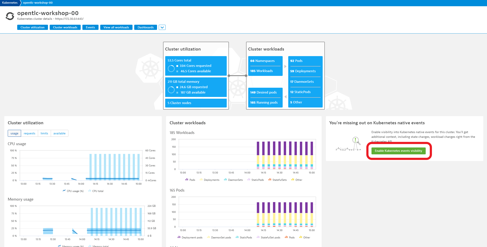
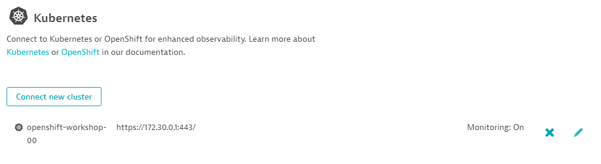
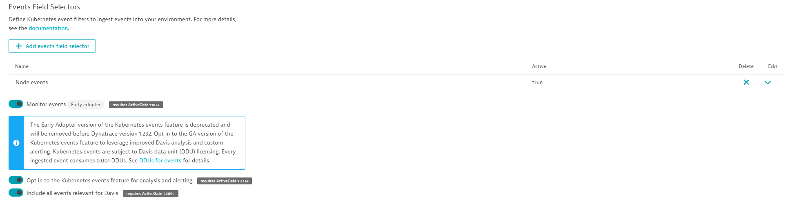
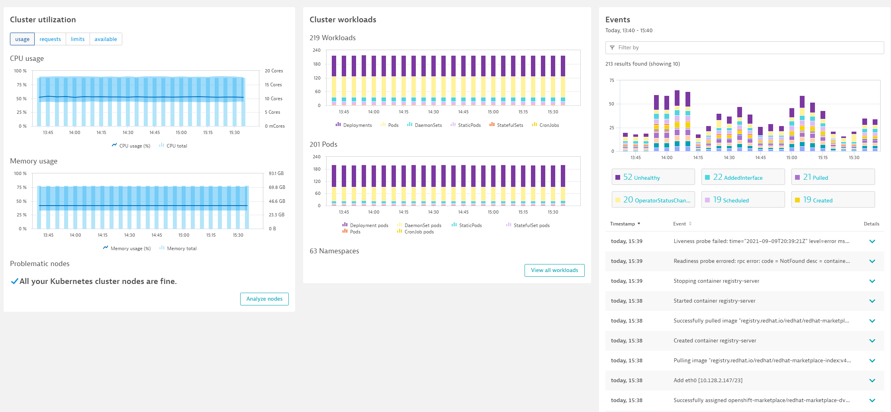

## Dynatrace Kubernetes Events Ingest

Dynatrace Kubernetes Events Ingest is a Dynatrace feature for Kubernetes that allows you to receive events from your cluster within Dynatrace. This allows you to accurately track Kubernetes events within the context of other activities in the cluster and can supply DAVIS with additional context around problems in your cluster provoding for more accurate root cause analysis.

1. Within the Dynatrace Kubernetes Overview screen, select "Enable Kubernetes events visibility". (This can also be accessed via Settings->Cloud and virtualization->Kubernetes)

       
1. Click the pencil next to the X to edit the Dynatrace configuration for your workload cluster.

    
1. Enable "Monitor Events" and then enable "Opt in to the Kubernetes events feature" as well as "Include al levents relevant for Davis"

    
1. Click the "Save" button.

1. As our cluster is likely healthy, we might not immediately see any events within the Dynatrace kubernetes overview. 

1. Should we wish to see additional events, you can enable additional events ingest by adding an additional events field selector

1. From the Kubernetes configuration screen, click the "Add events field selector" button.

1. Supply a name for the events field selector. Here we will use "Warning events"

1. Supply a field selector expression. Here we will use "type=Warning"

1. Click the "Activate" button.

1. Click the "Save" button.

1. After some time, if there are events matching our field selectors we should see events within the Dynatrace Kubernetes overview screen.

    