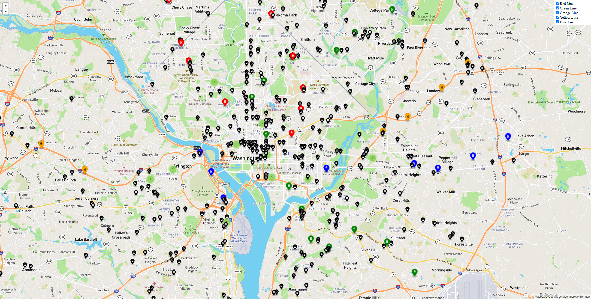

## CLI Steps (Optional)


1. Goto the terminal and type the following:

    ```bash
    $ oc new-project metro-map
    $ oc new-app --name=dc-metro-map https://github.com/RedHatGov/openshift-workshops.git --context-dir=dc-metro-map
    $ oc expose service dc-metro-map
    ```

    #### 💥 **TECHNICAL NOTE**

    _When using the CLI, OpenShift automatically detects the source code type and select the nodejs builder image._

## Check out the build details
We can see the details of what the S2I builder did.  This can be helpful to diagnose issues if builds are failing.

#### 💥 **TECHNICAL NOTE**
_TIP: For a node.js app, running "npm shrinkwrap" is a good practice to perform on your branch before releasing changes that you plan to build/deploy as an image with S2I_

## Viewing build details

1. Goto the terminal and type the following:

    ```bash
    $ oc get builds
    ```

1. Note the name of your build from the above command output and use it to see the logs with:

    ```bash
    $ oc logs builds/[BUILD_NAME]
    ```

The console will print out the full log for your build.  Note, you could pipe this to more or less for easier viewing in the CLI.

## See the app in action
Let's see this app in action!

1. Goto the terminal and type the following:

    ```bash
    $ oc get routes
    ```

1. Copy the HOST/PORT and paste into your favorite web browser:

1. The app should look like this in your web browser:

    
