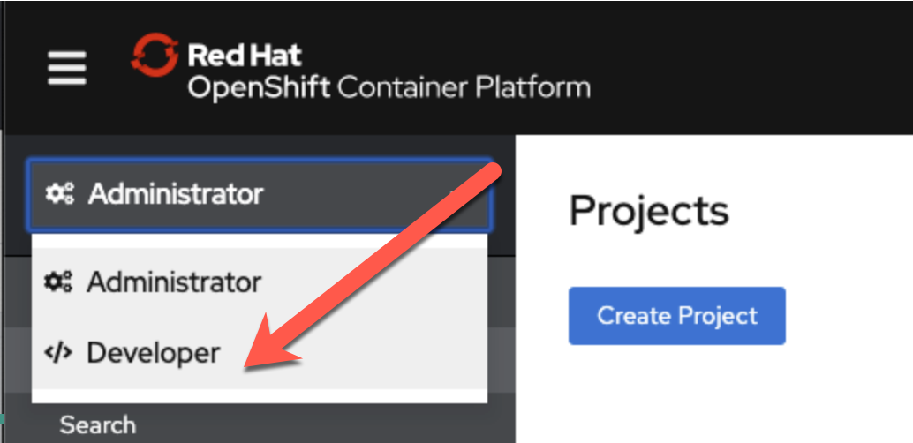
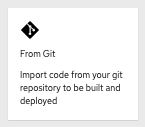
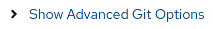
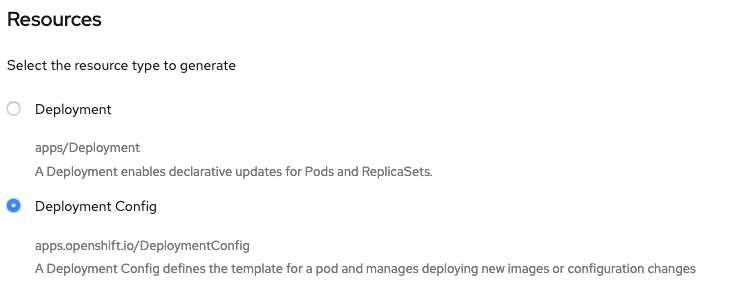

## Web Console Steps (Optional)
1. Switch to administrator mode, if you're not already there

    
1. Click on "Projects" then the "Create Project" button and give it a name of metro-map

    
1. Switch to developer mode and select the project metro-map if it did not take you there automatically

    
1. Click "+Add"

    
1. Click "From Git"

    
1. Fill out the "Git Repo URL" field as follows:

    <table>
    <tr><td><b>Git Repo URL</b></td><td><a href>https://github.com/RedHatGov/openshift-workshops.git</a></td></tr>
    </table>

    
1. Ensure that the repository is validated (as shown above)

1. Click on the "Show Advanced Git Options" expender

     

1. Fill out the "Context Dir" field as follows:

    <table>
    <tr><td><b>Context Dir</b></td><td>dc-metro-map</td></tr>
    </table>
    #### 💥 **TECHNICAL NOTE**
    _Do NOT include a leading / or the build will fail!_

1. Under "Builder", click click on the "Node.js" icon

    
1. Select Node.js 12 UBI7 (12-ubi7) in the Builder Image version

    
1. Fill out the fields, under "General" as follows:

    <table>
    <tr><td><b>Application</b></td><td>Create Application</td></tr>
    <tr><td><b>Application Name</b></td><td>dc-metro-map</td></tr>
    <tr><td><b>Name</b></td><td>dc-metro-map</td></tr>
    </table>

1. Choose "Deployment Configuration" 

    
1. Scroll to the bottom and click "Create"

## Check out the build details
We can see the details of what the S2I builder did.  This can be helpful to diagnose issues if builds are failing.

#### 💥 **TECHNICAL NOTE**
_For a node.js app, running "npm shrinkwrap" is a good practice to perform on your branch before releasing changes that you plan to build/deploy as an image with S2I_

## Viewing build details

1. Click on "Topology", the "node"/"dc-metro-map" icon, then Resources, and then on "View logs"

    
1. You should see a log output similar to the one below:

    

## See the app in action
Let's see this app in action!

1. Click on "Topology"

    
1. Click the arrow, at the top right corner of the "dc-metro-map" icon, to launch a new tab/window, with the running app

    
