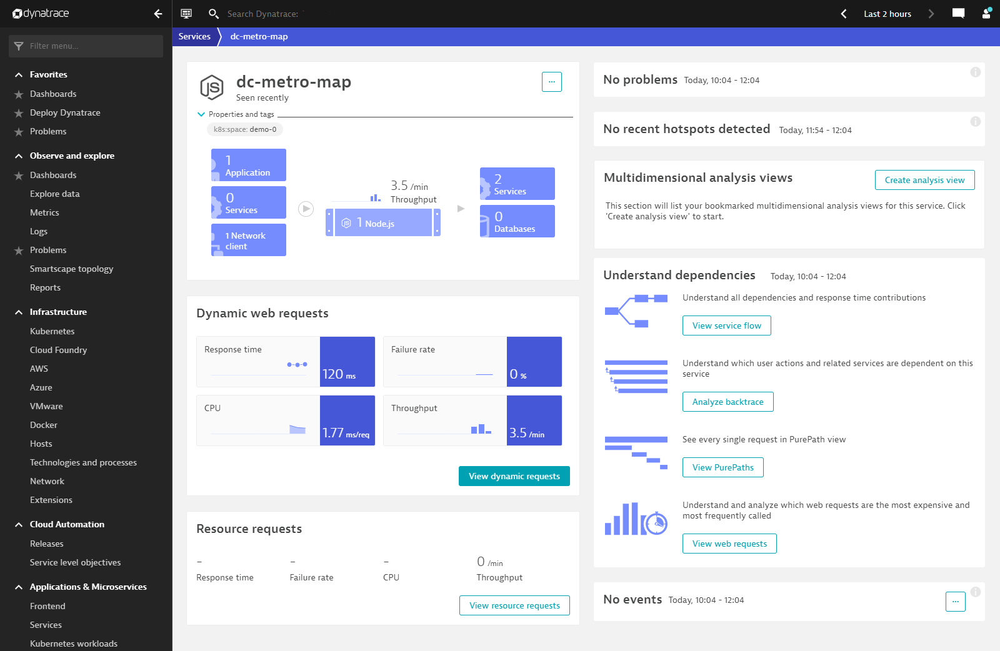

## Interacting with DC Metro App

Let's see this app in action!

The app should look like this in your web browser:

Clicking the checkboxes will toggle on/off the individual metro stations on each colored line.  A numbered icon indicates there is more than one metro station in that area and they have been consolidated - click the number or zoom in to see more.

# Now let's examine the application in Dynatrace

1. Switch back to the Dynatrace interface and select "Smartscape topology" -> "Services" -> "dc-metro-map" and observice the dependency mapping of this single-tier application.

    
1. The vertical mapping on the left shows the underlying process groups, host(s), and Data center(s) for the dc-metro-map service.  On the right hand side of the Smartscape topology view shows the peer services that the dc-metro-map service is communicating with. Continue to navigate the Dynatrace interface to examine the details of the dc-metro-map service and the node.js process group it is running in.

    
1. Although the processes and services are automatically discovered once the OneAgent is deployed, we still need to define the web entry point as an application using an application detection rule.  By default, all user traffic is placed under "My web application."  To create the "DC Metro Map" application and track the real user performance data for this application, start by defining the dc-metro-map entry point.  Click on "Settings" -> "Web and mobile monitoring" -> "Application Detection" -> "Add detection rule"

    
1. Enter "DC Metro Map" for the new application.  Select "If the URL" and "begins with..." as the definition.  Enter "http://dc-metro-map" in the example text box.  Finish defining the application by clicking on "Save."

    
1. To verify you created the new application in Dynatrace, select "Frontend" in the left navigation under "Applications and Microservices" and click on "DC Metro Map" in the center section.

    
1. No user interaction with the DC Metro Map application will be detected until you go back to the application interface and navigate the elements again.  It will still take a couple of minutes for the data to be processed and data to start populating this view.

    