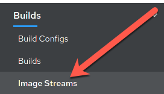

## Web Console Steps (Optional)


## See the app in action and inspect some details
OpenShift provides traceability for your running deployment, back to the container image, and the registry that it came from. Additionally, images built by OpenShift are traceable back to the exact [branch](https://help.github.com/en/github/collaborating-with-issues-and-pull-requests/about-branches) and [commit](https://help.github.com/en/github/getting-started-with-github/github-glossary#commit). Let's take a look at that!


1. Change modes to "Administrator", and then click on "Workloads", and "Deployment Configs".

    
1. Click on "dc-metro-map", under "Name", and check out the details of the deployment

    
1. Within the deployment for the dc-metro-map is a container summary that shows the detailed registry, container reference, and hash information, for the container that was deployed.

    
1. Click on "Builds", and then "Image Streams", in the left-side menu.

    
1. Click on the "dc-metro-map" image stream, to see its details.

    
1. You should see something like what is shown, below.

    
1. Click "Builds" and then "Builds", in the left-side menu, to get back to the build summary

    
1. Click "dc-metro-map-1" to see the build details

    


Because we built this app using S2I, we get to see the details about the build - including the container image that was used for building the source code.  Note that you can kick-off a rebuild here if something went wrong with the initial build and you'd like to attempt it again.

_Notice that, in the "Git Commit" section, you can see the comment from the last commit when the build was started, and you can see the that commit's author._


## Pod logs
In the S2I lab we looked at a build log to inspect the process of turning source code into an image.  Now let's inspect the log for a running pod - in particular let's see the web application's logs.

- Click on "Workloads" and then click on "Pods"

    

    This is going to show basic details for all pods in this project (including the builders). If you had a build failure or something similar earlier, you might see a pod that is in a error or failed state with a pod in the running state as shown in the screenshot below.

    

Next let's look at the log for the pod running our application.

1. Click the pod that starts with "dc-metro-map-"

    Here you see the status details of your pod as well as its configuration.  Take a minute here and look at what details are available.

    
1. Click the "Logs" button

    
    Now you can see, in the output window, the details of your app starting up, and any status messages that it has reported since it started.

## How about we set some environment variables?
Whether it's a database name or a configuration variable, most applications make use of environment variables.  It's best not to bake these into your containers because they do change and you don't want to rebuild an image just to change an environment variable.  Good news!  You don't have to.  OpenShift let's you specify environment variables in your deployment configuration and they get passed along through the pod to the container.  Let's try doing that.


1. Click on "Workloads", and last, click on "Deployment Configs", in the left-side menu.
    This is going to show basic details for all build configurations in this project

1. Click the "dc-metro-map" build config.
1. Click the "Environment" tab next to the "Pods" tab .

    
    This opens up a tab with the environment variables for this deployment config.

1. Add an environment variable with the name BEERME and a value of 'true'

    
1. Click "Save"

If you are quick enough, you will see a new pod spin up, and the old pod spin down.  This is due to the deployment config strategy being set to "Rolling", and having a "ConfigChange" trigger. Thus, OpenShift auto deployed a new pod as soon as you updated with the environment variable.


With the new environment variables set the app should look like this in your web browser (with beers instead of busses):


## Getting into a pod
There are situations when you might want to jump into a running pod, and OpenShift lets you do that pretty easily.  We set some environment variables, in this lab, so let's jump onto our pod to inspect them.  

1. Click on "Workloads" and then click on "Pods"

1. Click the pod that starts with "dc-metro-map-" and has a status of Running

1. Click the "Terminal" button

    

## Let's look for the environment variables we set


Inside the web page's terminal type this:

```bash
$ env | grep BEER
```

That should return **BEERME=true**, matching the value that we set in the deployment config.

