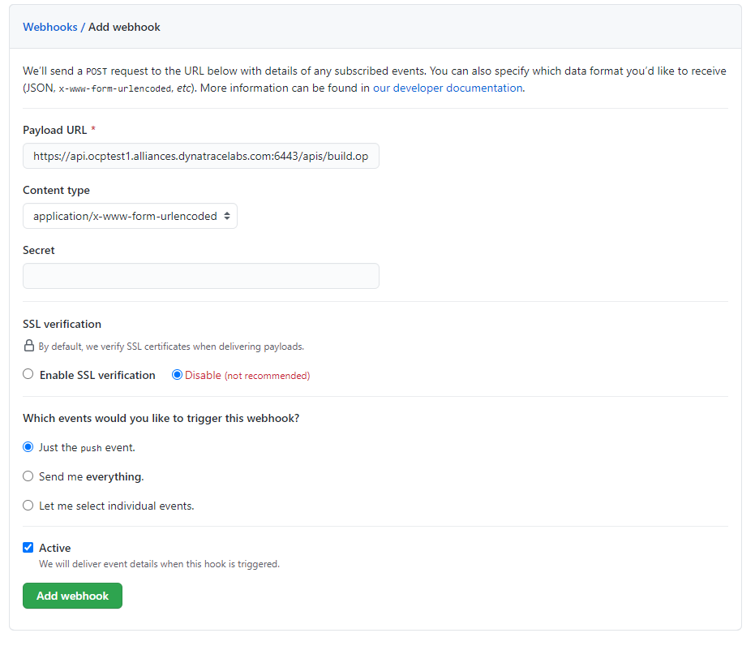

## CLI Steps (Optional)

The node.js builder template creates a number of resources for you, but what we care about right now is the build configuration because that contains the webhooks. So to get the URL:

1. Goto the terminal and type the following:
    ```bash
    $ oc get bc/dc-metro-map -o yaml | grep generic-webhook
    ```
1. which returns the name of the secret that we need to find:

    ```bash
    name: dc-metro-map-generic-webhook-secret
    ```

1. Now that you have the name of the secret, you can get its value:

    ```bash
    $ SECRET=`oc get secrets dc-metro-map-generic-webhook-secret -o json | jq -r '.data.WebHookSecretKey' | base64 -d ; echo`
    ```

1. Last, we can get the URL for the webhook, this way:

    ```bash
    $ oc describe bc/dc-metro-map | grep "Webhook Generic" -A 1 | sed "s/<secret>/${SECRET}/"
    ```

1. which results in the information that we need:

    ```bash
    Webhook Generic:
        URL:        https://api.ocptest-alliances.dynatracelabs.com:6443/apis/build.openshift.io/v1/namespaces/demo-0/buildconfigs/dc-metro-map/webhooks/813f423c1d78b005/generic    
    ```

1. Copy the "Webhook Generic" URL to the clipboard, so that we can use it in GitHub.

1. Now switch back over to github 

1. Let's put the webhook URL into the repository. At the main page for this repository (the fork), you should see a tab bar with code, pull requests, pulse, graphs, and settings.

    
1. Click the "Settings" tab

1. Now you will see a vertical list of settings groups.

1. Click the "Webhooks" link

    
1. Click the "Add webhook" button

1. Paste in the URL you copied

1. Disable SSL verification by clicking the button

    
1. Click the "Add webhook" button

Good work! Now any "push" to the forked repository will send a webhook that triggers OpenShift to: re-build the code and image using s2i, and then perform a new pod deployment.  In fact Github should have sent a test trigger and OpenShift should have kicked off a new build already.

## Rollbacks
Well, what if something isn't quite right with the latest version of our app?  Let's say some feature we thought was ready for the world really isn't - and we didn't figure that out until after we deployed it.  No problem, we can roll it back with the click of a button.  Let's check that out:


- Goto the terminal and type the following:

    ```bash
    $ oc rollout undo dc/dc-metro-map
    $ oc get pods -w
    ```
OpenShift has done a graceful removal of the old pod and created a new one.  

#### 💥 **TECHNICAL NOTE**
_Note that the old pod wasn't killed until the new pod was successfully started and ready to be used.  This is so that OpenShift could continue to route traffic to the old pod until the new one was ready._


