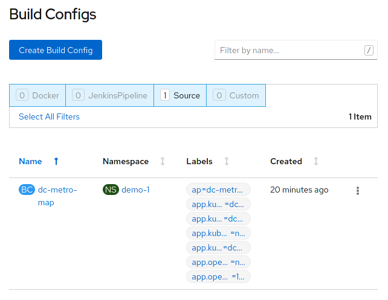
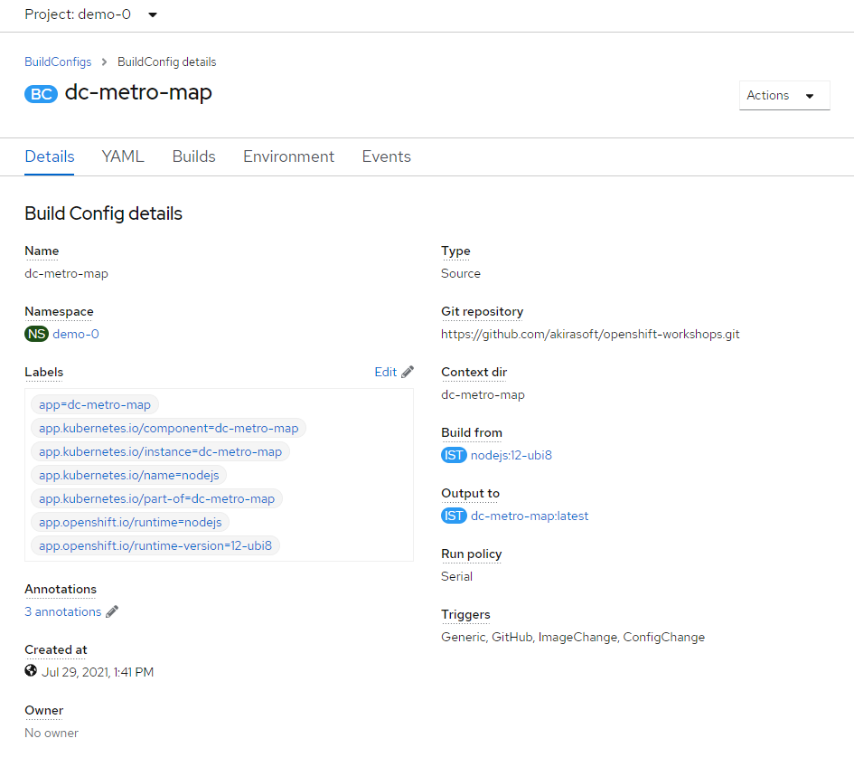
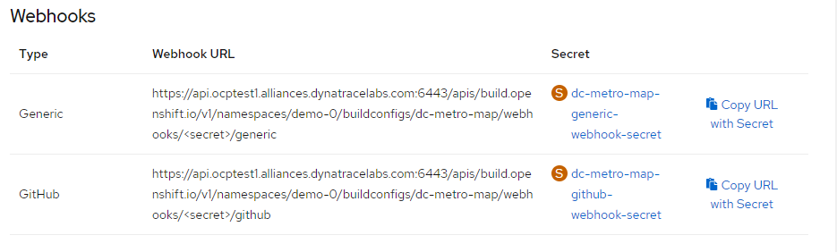
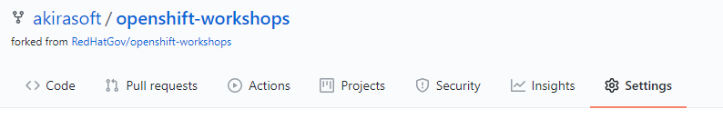
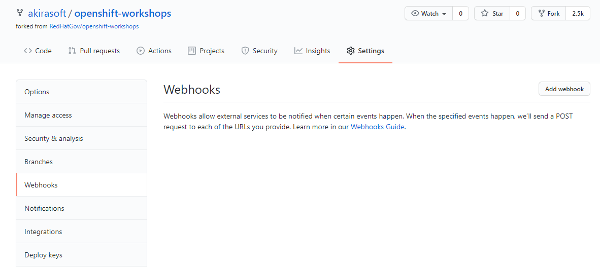
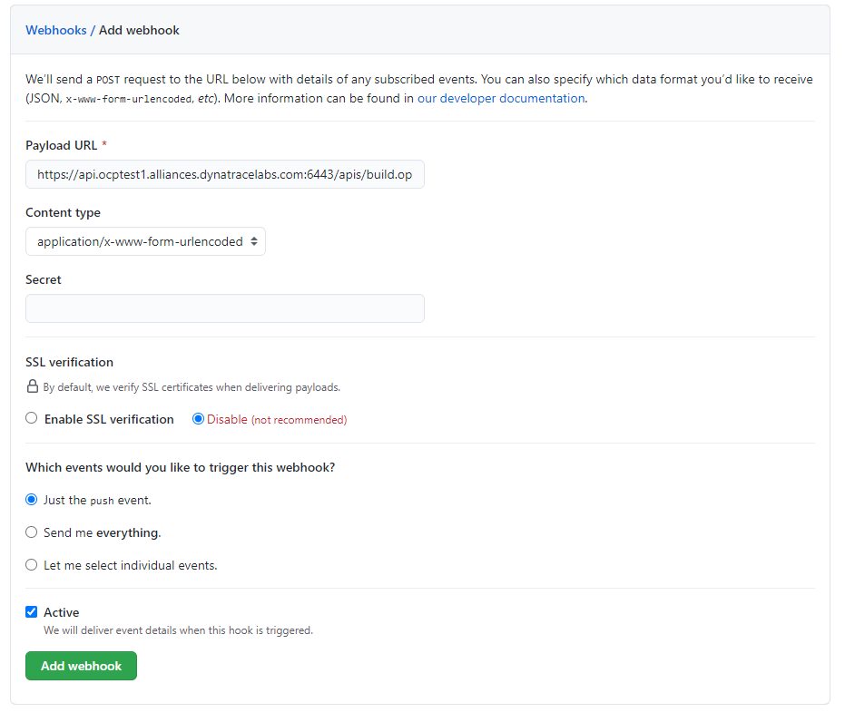
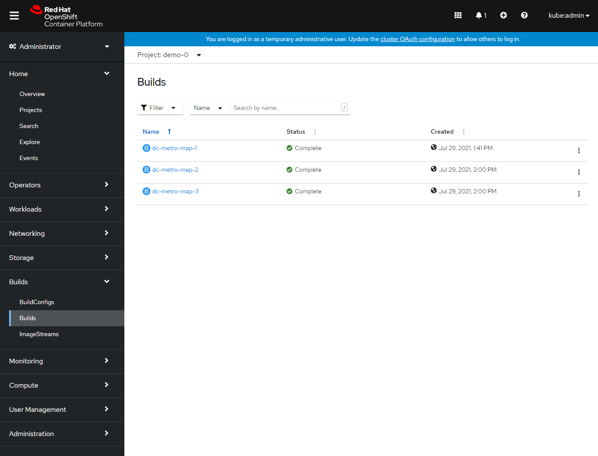
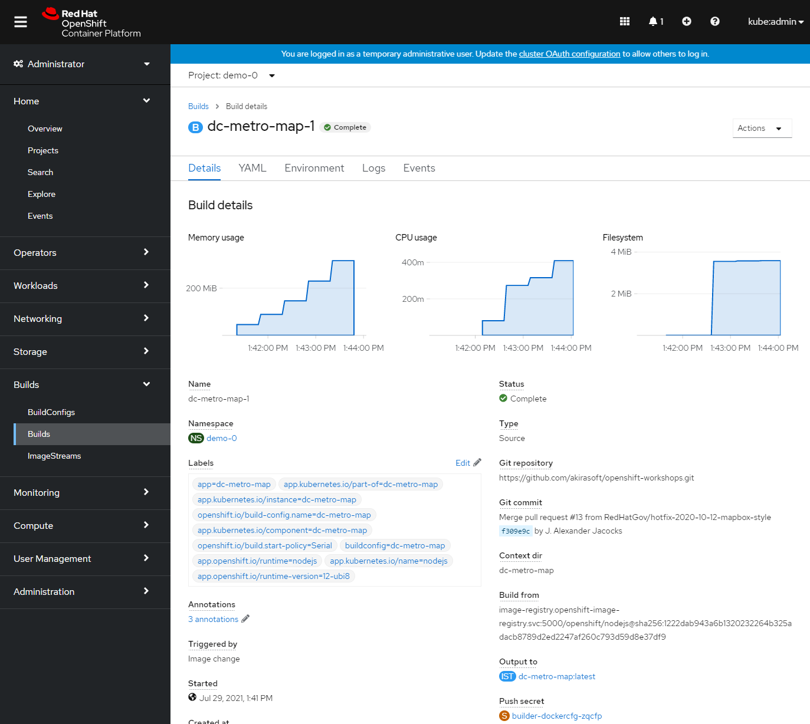
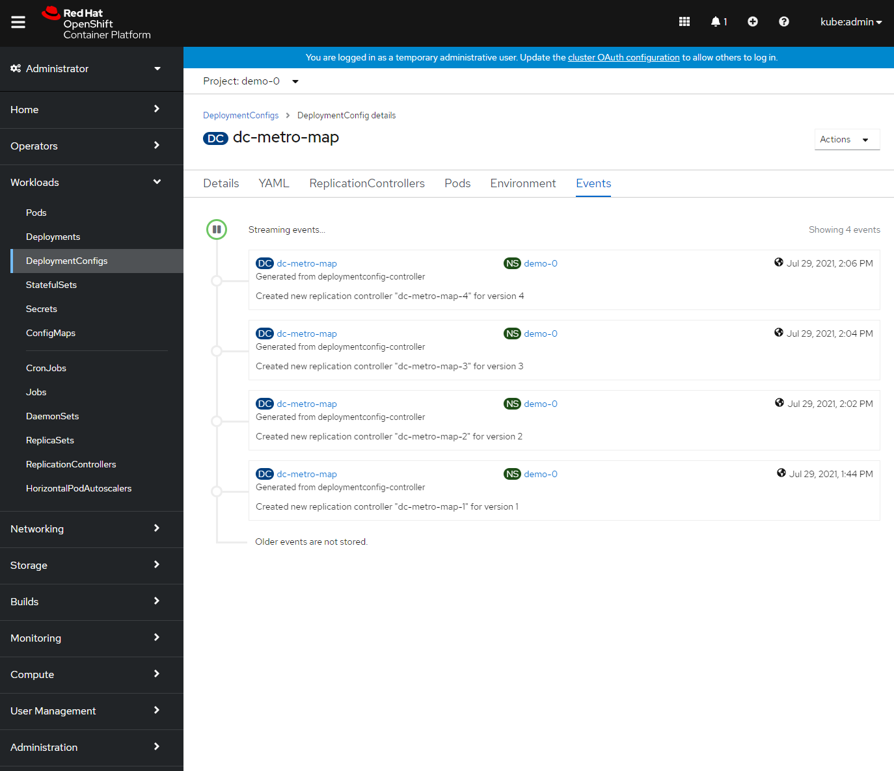

## Web Console Steps (Optional)

The node.js builder template creates a number of resources for you, but what we care about right now is the build configuration because that contains the webhooks.  So to get the URL:

1. in "Administrator" mode, click on "Builds" and then click on "Build Configs"
    This is going to show basic details for all build configurations in this project

    
1. Click the "dc-metro-map" build config

    
    

    You will see the summary of builds using this build config
1. Scroll to the bottom of the window.

    

    Now you can see the links to get the various secrets.

1. Copy the Generic webhook to the clipboard, by clicking on "Copy URL with Secret"

1. Now switch back over to github 

1. Let's put the webhook URL into the repository. At the main page for this repository (the fork), you should see a tab bar with code, pull requests, pulse, graphs, and settings.

    
1. Click the "Settings" tab

    Now you will see a vertical list of settings groups.

1. Click the "Webhooks" link

    
1. Click the "Add webhook" button

1. Paste in the URL you copied

1. Disable SSL verification by clicking the button

    
1. Click the "Add webhook" button

Good work! Now any "push" to the forked repository will send a webhook that triggers OpenShift to: re-build the code and image using s2i, and then perform a new pod deployment.  In fact Github should have sent a test trigger and OpenShift should have kicked off a new build already.

## Rollbacks
Well, what if something isn't quite right with the latest version of our app?  Let's say some feature we thought was ready for the world really isn't - and we didn't figure that out until after we deployed it.  No problem, we can roll it back with the click of a button.  Let's check that out:

1. Click on "Builds" and then click on "Builds"
This is going to show basic details for all builds, for the dc-metro-map application.

    
1. Click the "dc-metro-map" build that you want to roll back to. For the purposes of this lab, click dc-metro-map-1.

1. Click on 'Actions', and then 'Rebuild', from the menu, in the upper right corner of the window.

    
1. You can go back to the 'Workloads', 'DeploymentConfigs', 'dc-metro-map' page, and click on the 'Events' tab, to see your previous deployment spinning down and your new one spinning up.
    

    OpenShift has done a graceful removal of the old pod and created a new one.  

#### 💥 **TECHNICAL NOTE**
_Note that the old pod wasn't killed until the new pod was successfully started and ready to be used.  This is so that OpenShift could continue to route traffic to the old pod until the new one was ready._

