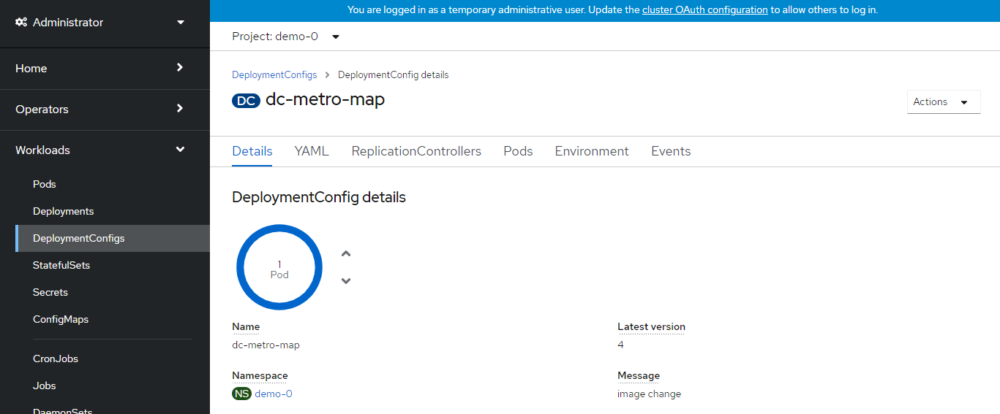
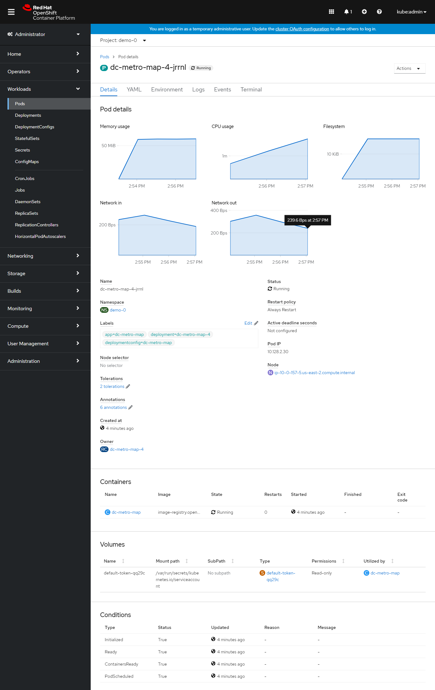
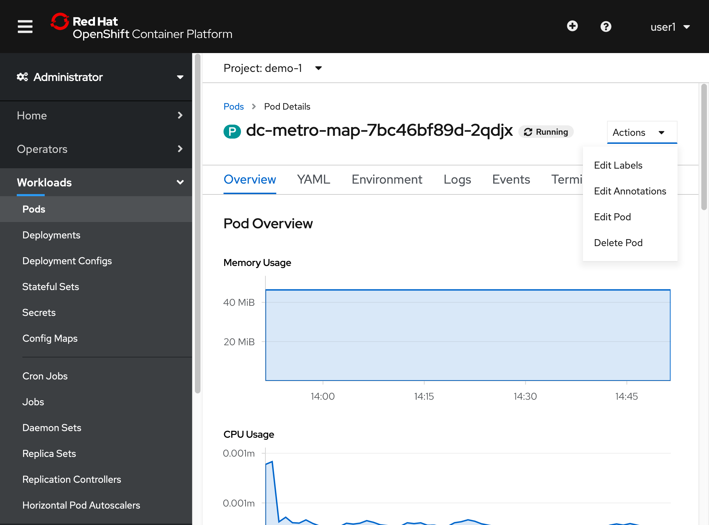
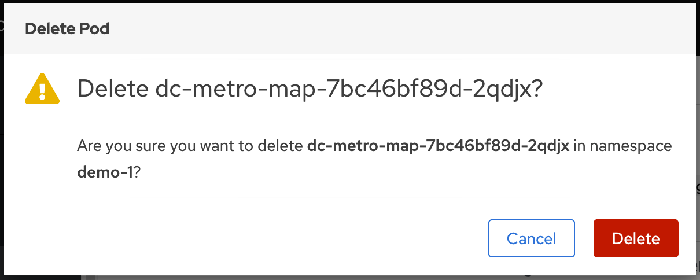
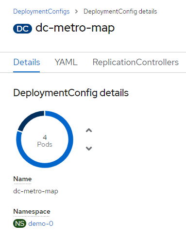
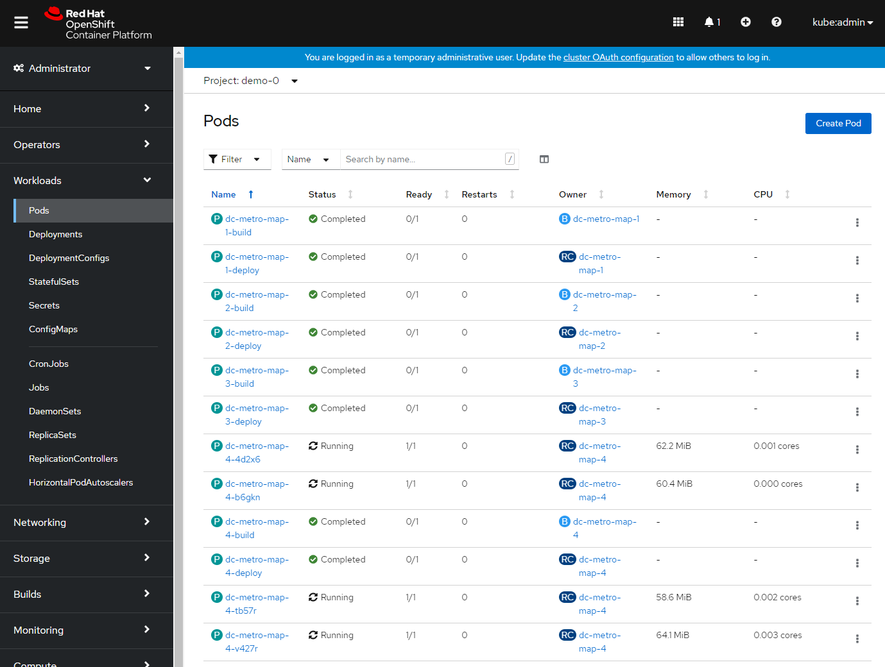
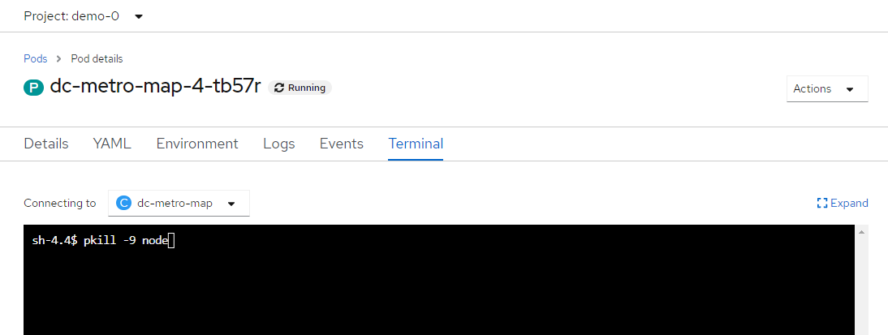

## Web Console Steps (Optional)

## Replication
Let's walk through a simple example of how the replication controller can keep your deployment at a desired state.  Assuming you still have the dc-metro-map project running we can manually scale up our replicas to handle increased user load.


1. Click "Workloads", then "Deployment Configuration", and then "dc-metro-map"

1. In the Deployment Config Details, click the up arrow 3 times.

    The deployment should indicate that it is scaling to 4 pods, and eventually you will have 4 running pods.  Keep in mind that each pod has it's own container which is an identical deployment of the webapp.  OpenShift is now (by default) round robin load-balancing traffic to each pod.
    
1. Click the Pods tab, and select one of the pods (ex: dc-metro-map-X-XXXX)

    Notice that you now have 4 unique webapp pods available to inspect.  If you want go ahead and inspect them you can see that each has its own IP address and logs.
    

So you've told OpenShift that you'd like to maintain 4 running, load-balanced, instances of our web app.

## Recovery
Okay, now that we have a slightly more interesting replication state, we can test a service outages scenario. In this scenario, the dc-metro-map replication controller will ensure that other pods are created to replace those that become unhealthy.  Let's forcibly inflict an issue and see how OpenShift responds.

From the browse pods list:

1. Click one of the running pods (not a build pod)

1. Click the "Actions" button in the top right and then select "Delete Pod"

    
1. Now click the "Delete" button in the popup to confirm the pod deletion

    
1. Quickly switch back to the deployment configuration overview
    
    
    
    _If you're fast enough you'll see the pod you deleted unfill a portion of the deployment circle, and then a new pod fill it back up._
1. You can browse the pods list again to see the old pod was deleted and a new pod with a recent age.

    

## Application Health
In addition to the health of your application's pods, OpenShift will watch the containers inside those pods.  Let's forcibly inflict some issues and see how OpenShift responds.  


1. Navigate to browse the pods list, and click on a running pod

1. In the tab bar for this pod, click on "Terminal"

1. Click inside the terminal view and type ```$ pkill -9 node```

    
1. This is going to kill the node.js web server, and kick you off of the container's terminal.

    
