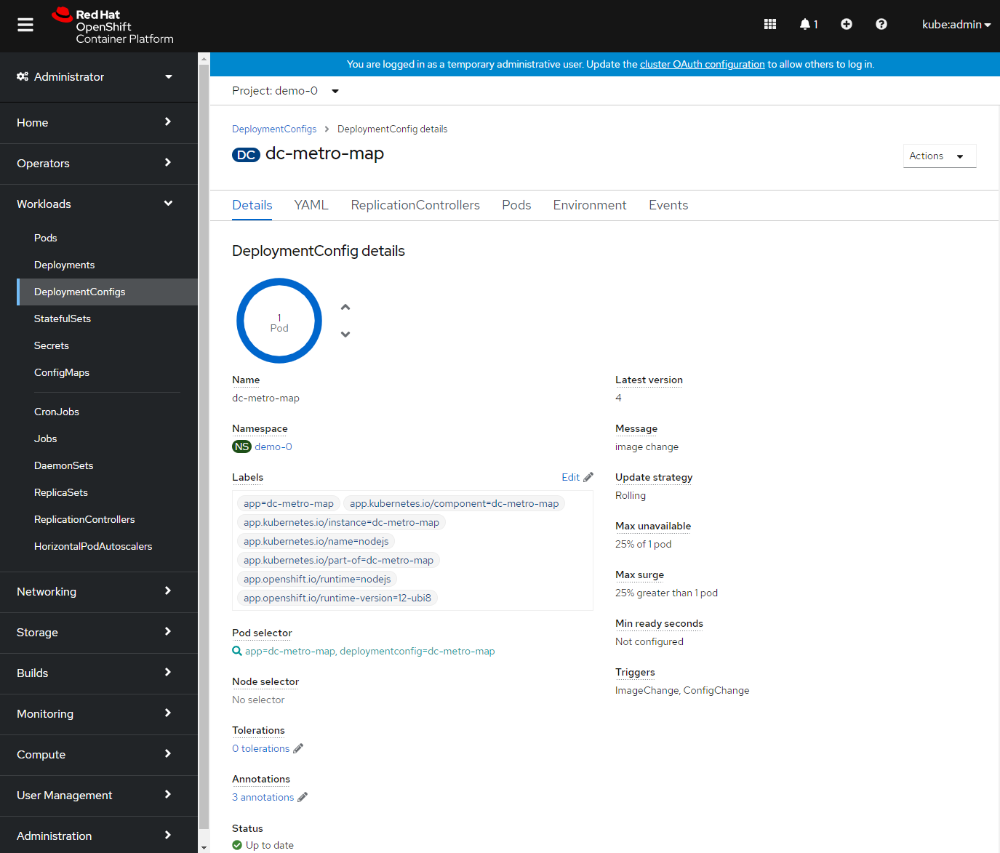

## Clean Up and Summary

# Clean up
Let's scale back down to 1 replica.  If you are using the web console just click the down arrow from the Deployments Configs Overview page.  If you are using the command line use the ```oc scale``` command.

<br/>

# Summary
In this lab we learned about replication controllers and how they can be used to scale your applications and services.  We also tried to break a few things and saw how OpenShift responded to heal the system and keep it running.  
