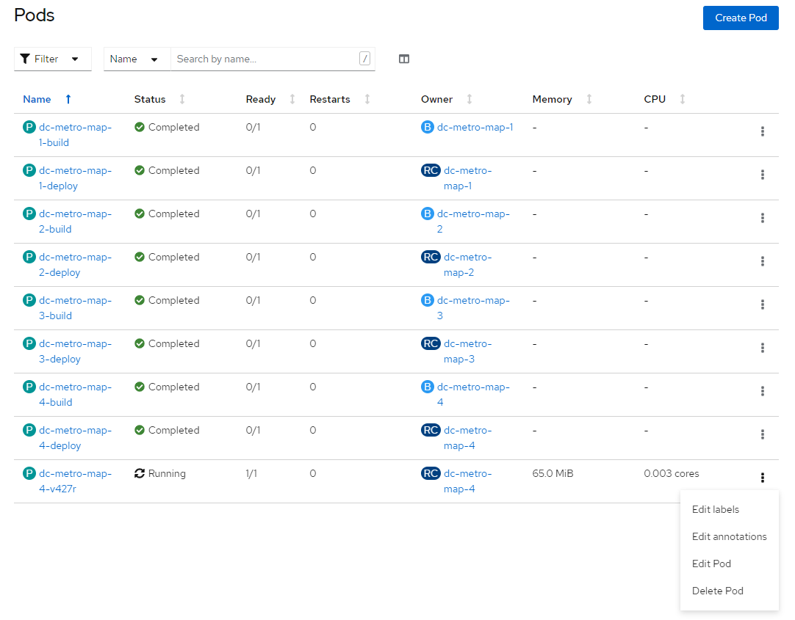
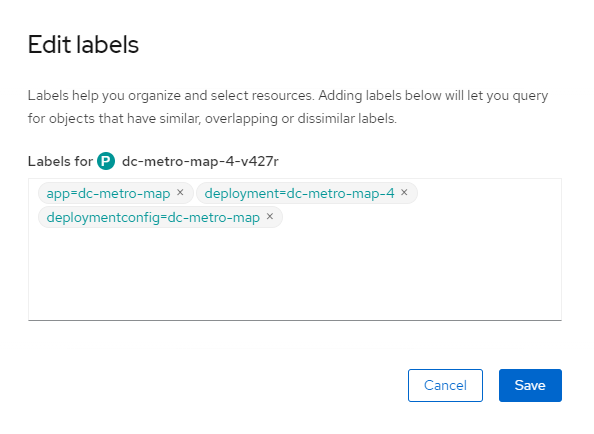
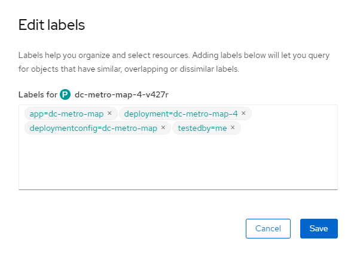
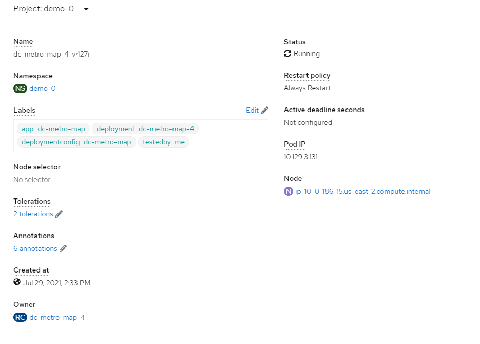

## Web Console Steps (Optional)

## Labels on a pod
In a previous lab we added our web app using a S2I template.  When we did that, OpenShift labeled our objects for us.  Let's look at the labels on our running pod.

1. Click "Workloads", click on "Pods", then click on the three vertical dots next to the "Running" pod.  Consider filtering for Status "Running".

    
1. Click "Edit Labels"

    
1. Here, at the top, you can see the labels on this pod

1. Add 'testedby=me' and click "Save"

    
1. Your updated label will show up in the running pods.

1. Select Workloads -> Pods -> dc-metro-map (Running POD), then scroll down to "Labels"

    
